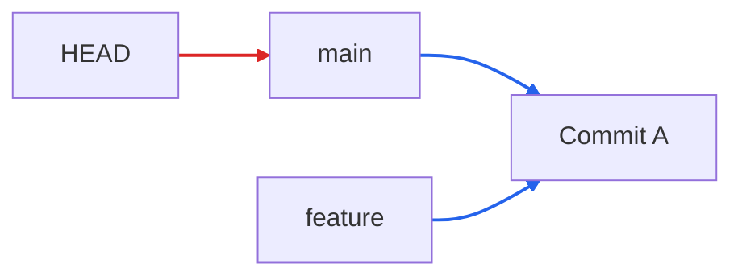
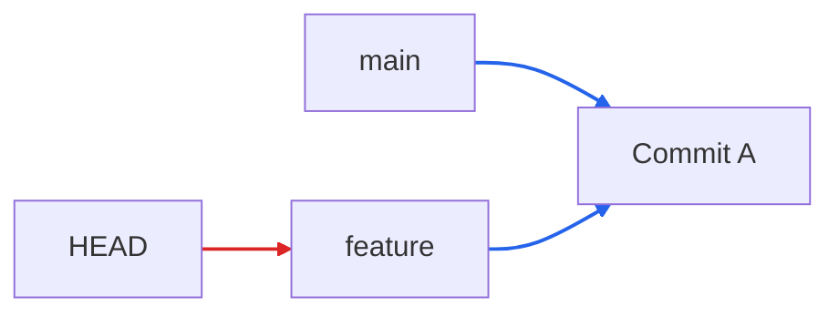
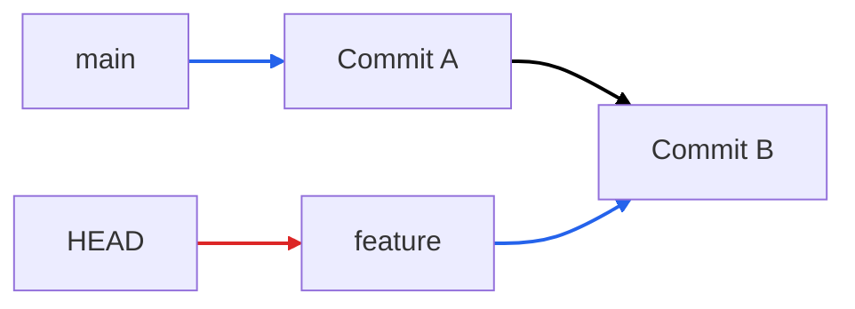
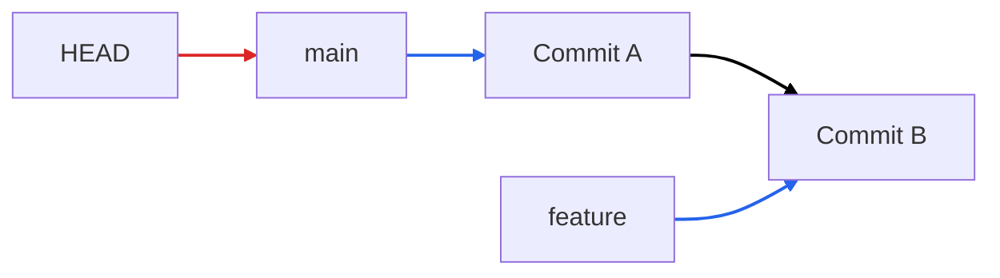
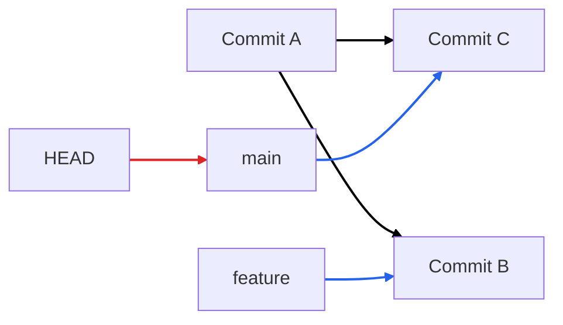
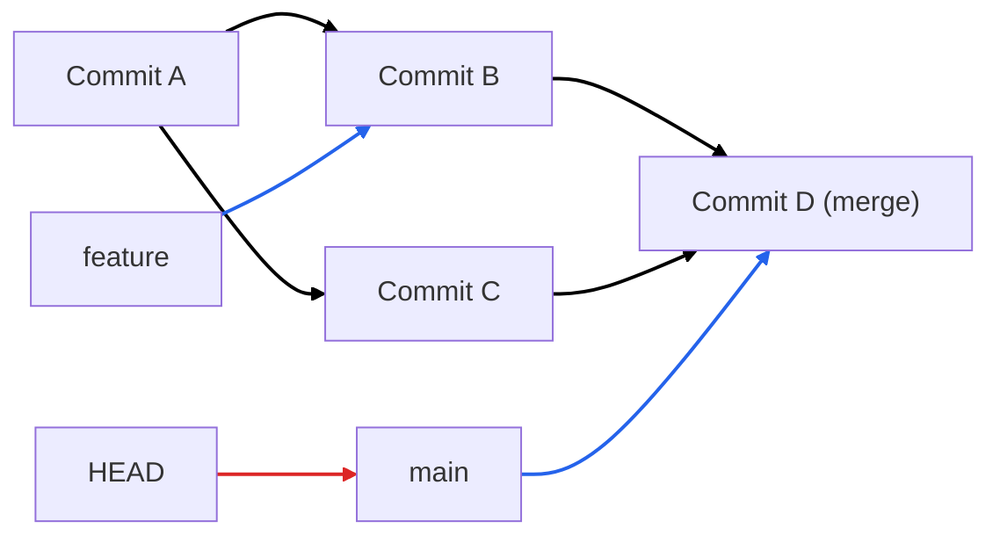

Git history - a graph of commits  
`HEAD` - a pointer to a branch (`main` is the default branch) 
>`git checkout <branch/commitID>` moves the `HEAD` pointer  
>`git branch` to see what all the branches and what the `HEAD` is pointing to at the moment

branch - a pointer to the most recent commit *on that* branch
>As you commit, the branch pointer moves

**Detach HEAD** - `git checkout <commitID>` to move the HEAD pointer to that status of the working dir 

### Local  
working in Terminal
- creating a project folder and initialising it with content  
- `git init` to add .git to directory to track changes  
- go to the parent folder inside which you wish to **clone** a remote repo and `git clone <URL(HTTPS)>`   

Cloning:  
1. Copy files – Creates a local folder with all the repository’s files and directories.
2. Copy history – Downloads the full Git history, including all commits, branches, and tags.
3. Set remote – Adds origin pointing to the original repo so you can pull and push changes.  

- Local(as opposed to global) config:
```
git config user.name "New Name"  
git config user.email "new@email.com"
```

- `git status` shows the local changes(untracked, modified, staged, committed) made
> `git fetch` or `git pull` includes the original changes too

- To stage the changes, for one file use `git add <file_name>` and for the entire dir and everything inside it `git add .`  
- `git reset` to unstage changes  

- `git commit -m "<message>"` to commit the changes 
>Commit moves the branch and with it the `HEAD` also moves
- `git reset HEAD~` to undo committed changes to unstaged status  
- `git diff <commitID1> <commitID2>` to compare states  
- `git log`  or `git log --oneline`to see all commit history(local & remote before cloning)

##### Remove a file:
1. Manually remove it, stage and commit changes
2. `git rm <file_name>` or `git rm -r <folder>` to remove and stage the change
- to undo deletion, use `git reset --hard`
>[!Note]
>You cannot remove a untracked file through git

##### File Tracking States
Each file is always in exactly one state:

1. Untracked
- File exists
- Git ignores it
Example: new file created

2. Modified
- File was tracked before
- Contents changed  

3. Staged  

4. Committed
- Exists in history

#### Branching  
- to work on a feature that doesn't affect the main, test and then finally merge it to main
![[Pasted image 20251230230953.png]]

- Default branch: `main`  
- Create branch: `git branch feature`  
- Switch branch: `git checkout feature`  
  - `git stash` to save unstaged changes inside a temp stack and `git stash pop` or `git stash apply` to restore
>`HEAD` - pointer to current branch which also makes it point to the latest commit  

##### Merging
```
main          ← stable
feature-x    ← your work
git checkout main
git merge feature-x
```
main now contains changes from feature-x
feature-x remains unchanged

>[!Note]
>Branches don’t stay “linked” after a merge.

**EXAMPLE:**
0. You are on `main`  

1. Create branch `feature`


2. Switch to `feature` 

3. Commit on `feature`

4. Switch to `main`

5. Commit on `main`

6. Merge `feature` into `main`

##### Merge conflicts  
Conflict happens when: Same file, same lines, different content
Git stops and marks:
```
>>>>>>
======
>>>>>>
```
To resolve: 
1. Edit file
2. git add
3. git commit

- To abort a merge: `git merge --abort`  
- Example: 
	Before the first merge: d had 444, s had 44
	No resolution existed
	
	After the first merge:
	d has a commit that explicitly chooses 444 over 44
	That decision is now part of history.
	So when you merge again, Git is not re-asking the same question.
	It already has the answer.


---  
### Remote  
- creating a new repo and initialising it with content(commit to save changes)
- `git push origin main` to push history of local to remote on main branch alone(`git push origin feature` for others)  
- `git fetch` for bringing changes from remote to local -> `git merge`(on main branch)
- `git pull` to fetch and merge
  
TO DO:   
1. restore
2. rebase
  
resources: https://www.youtube.com/watch?v=mAFoROnOfHs 

